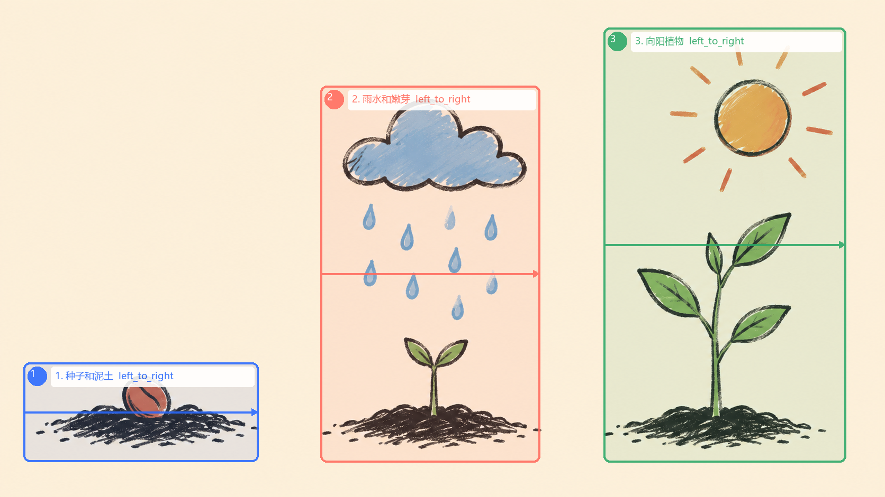

# 科技俊白板工坊

中文 | [English](README.en.md)

把 SRT 字幕、无文字插画和品牌笔手制作成流式白板手绘 MP4，适合知识科普、故事口播、课程短视频和系列化日更内容。

## 示例视频

### 完整多幕示例

[下载/播放《AI Agent 和普通聊天机器人》1080P 成片](examples/agent-vs-chatbot/techjun-agent-demo-1080p.mp4)

- 8 幕，44.7 秒，1920x1080，60fps
- 包含中文旁白、同步字幕、信息卡片、BGM 和转场音效
- [查看完整示例资产与音频来源](examples/agent-vs-chatbot/README.md)

### 单幕渲染示例

[下载/播放种子生长示例](examples/scene-01-seed-growth-whiteboard.mp4)

示例主题：种子落入土里 -> 雨水让它发芽 -> 长成向阳植物。



## 功能

- SRT 字幕解析和场景分镜草稿
- `ink -> color` 流式笔迹渲染
- 分离式插画自动生成标注初稿
- 区域、顺序、时序和遮挡保护区控制
- 科技俊品牌笔手素材
- 1080P / 60fps 多幕输出
- 旁白、字幕、信息卡片和音效合成参考
- Windows、macOS、Linux 支持
- 可作为 Codex Skill 使用

## 快速开始

```bash
python scripts/prepare_env.py
python scripts/techjun.py storyboard examples/seed-growth.srt --out project --config config/default.json
python scripts/techjun.py annotate image.png examples/cues.json image.annotation.json
python scripts/techjun.py preview image.png image.annotation.json image-preview.png
python scripts/validate_project.py image.png image.annotation.json
python scripts/techjun.py render image.png image.annotation.json output.mp4 --config config/default.json
```

## 无人值守模式

配置好 `WISART_API_KEY` 后，一条命令完成生图、标注、校验、渲染和多幕合并：

```bash
python scripts/techjun.py autopilot input.srt --out output-autopilot --config config/default.json
```

中断后可从已有图片继续：

```bash
python scripts/techjun.py autopilot input.srt --out output-autopilot --config config/default.json --resume
```

结果位于 `output-autopilot/final.mp4`，每幕目录保存图片、节点、标注、预览图和单幕视频，`manifest.json` 记录状态与路径。

图片与标注必须同名。智画生成的源图应遵循：暖米黄纸张、深灰线稿、少量概念色、画面无文字。

## 许可证与来源

本项目是 [geeklee/srt-whiteboard-animation](https://github.com/geeklee/srt-whiteboard-animation) 的独立二创版本，保留上游 MIT 许可和来源声明；新增代码、配置和“科技俊”品牌素材由本项目维护。详见 [LICENSE](LICENSE)。
